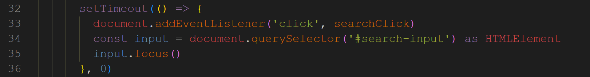

# Hexo kaze主题修改

## 默认点击搜索按钮没有获取焦点，需要再点一次。强迫症不能忍，修改下


kaze模板使用typescript，进入项目文件夹。安装依赖

```base
cd 项目文件夹\themes\kaze\
npm install
```


打开search.ejs模板文件，添加获取焦点函数。在34-35行添加以下代码

```javascript
const input = document.querySelector('#search-input') as HTMLElement
input.focus()
```




进入src/script目录，重新编译es文件

```base
..\..\node_modules\.bin\rollup -c
```


切换到项目文件夹根目录，执行hexo clean，hexo server检查是否添加成功
