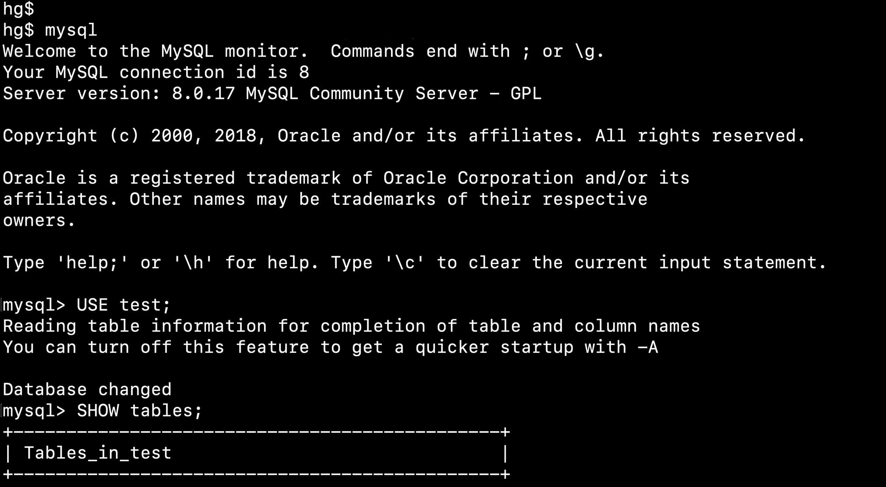

# 什么是数据库？

数据库（Database）是按照数据结构来组织、存储和管理数据的仓库。每个数据库都有一个或多个不同的 API 用于创建，访问，管理，搜索和复制所保存的数据。我们也可以将数据存储在文件中，但是在文件中读写数据速度相对较慢。所以，现在我们使用关系型数据库管理系统（RDBMS）来存储和管理大数据量。所谓的关系型数据库，是建立在关系模型基础上的数据库，借助于集合代数等数学概念和方法来处理数据库中的数据。

RDBMS 即关系数据库管理系统(Relational Database Management System)的特点：

- 1.数据以表格的形式出现
- 2.每行为各种记录名称
- 3.每列为记录名称所对应的数据域
- 4.许多的行和列组成一张表单
- 5.若干的表单组成database

# MySQL数据库介绍

 

  

MySQL是一个关系型数据库管理系统，由瑞典MySQL AB 公司开发，属于 Oracle 旗下产品。MySQL 是最流行的关系型数据库管理系统之一，在 WEB 应用方面，MySQL是最好的 RDBMS (Relational Database Management System，关系数据库管理系统) 应用软件之一。

MySQL在过去由于性能高、成本低、可靠性好，已经成为最流行的开源数据库，因此被广泛地应用在Internet上的中小型网站中。随着MySQL的不断成熟，它也逐渐用于更多大规模网站和应用，比如维基百科、Google和Facebook等网站。非常流行的开源软件组合LAMP中的“M”指的就是MySQL。

但被甲骨文公司收购后，Oracle大幅调涨MySQL商业版的售价，且甲骨文公司不再支持另一个自由软件项目[OpenSolaris](https://zh.m.wikipedia.org/wiki/OpenSolaris)的发展，因此导致自由软件社群们对于Oracle是否还会持续支持MySQL社群版（MySQL之中唯一的免费版本）有所隐忧，MySQL的创始人麦克尔·维德纽斯以MySQL为基础，成立分支计划[MariaDB](https://zh.m.wikipedia.org/wiki/MariaDB)。而原先一些使用MySQL的开源软件逐渐转向MariaDB或其它的数据库。例如维基百科已于2013年正式宣布将从MySQL迁移到[MariaDB](https://zh.m.wikipedia.org/wiki/MariaDB)数据库[[6\]](https://zh.m.wikipedia.org/zh-sg/MySQL#cite_note-6)。

MySQL的license现在分为免费的社区版与收费的标准版、企业版等[[7\]](https://zh.m.wikipedia.org/zh-sg/MySQL#cite_note-7)。一般说来，如果在非开源项目中发布了MySQL，或者需要Oracle公司提供对MySQL的技术支持，或者使用MySQL的一些企业版工具或插件，或者修改MySQL原始码并作为闭源的软件等等情形，需要购买商业版本。如果只是安装并使用MySQL，甚至修改并使用MySQL，无论是否收费；或者软件中不包含MySQL，软件的用户自行安装MySQL；或者使用GPL协议的开源软件产品中包含了MySQL，这些情形可能使用社区版MySQL

 

# 支持操作系统

- 支持[AIX](https://zh.m.wikipedia.org/wiki/AIX)、[BSDi](https://zh.m.wikipedia.org/w/index.php?title=BSDi&action=edit&redlink=1)、[FreeBSD](https://zh.m.wikipedia.org/wiki/FreeBSD)、[HP-UX](https://zh.m.wikipedia.org/wiki/HP-UX)、[Linux](https://zh.m.wikipedia.org/wiki/Linux)、[Mac OS](https://zh.m.wikipedia.org/wiki/Mac_OS)、[Novell NetWare](https://zh.m.wikipedia.org/wiki/Novell_NetWare)、[NetBSD](https://zh.m.wikipedia.org/wiki/NetBSD)、[OpenBSD](https://zh.m.wikipedia.org/wiki/OpenBSD)、[OS/2 Wrap](https://zh.m.wikipedia.org/wiki/OS/2)、[Solaris](https://zh.m.wikipedia.org/wiki/Solaris)、[Windows](https://zh.m.wikipedia.org/wiki/Windows)等多种[操作系统](https://zh.m.wikipedia.org/wiki/作業系統)。

 

# 支持编程语言

- 编程语言包括[C](https://zh.m.wikipedia.org/wiki/C語言)、[C++](https://zh.m.wikipedia.org/wiki/C%2B%2B)、[C#](https://zh.m.wikipedia.org/wiki/C♯)、[VB.NET](https://zh.m.wikipedia.org/wiki/VB.NET)、[Delphi](https://zh.m.wikipedia.org/wiki/Delphi)、[Eiffel](https://zh.m.wikipedia.org/wiki/Eiffel)、[Java](https://zh.m.wikipedia.org/wiki/Java)、[Perl](https://zh.m.wikipedia.org/wiki/Perl)、[PHP](https://zh.m.wikipedia.org/wiki/PHP)、[Python](https://zh.m.wikipedia.org/wiki/Python)、[Ruby](https://zh.m.wikipedia.org/wiki/Ruby)和[Tcl](https://zh.m.wikipedia.org/wiki/Tcl)等。

 

# MySQL优势

- MySQL 是开源的，目前隶属于 Oracle 旗下产品。
- MySQL 支持大型的数据库。可以处理拥有上千万条记录的大型数据库。
- MySQL 使用标准的 SQL 数据语言形式。
- MySQL 可以运行于多个系统上，并且支持多种语言。这些编程语言包括 C、C++、Python、Java、Perl、PHP、Eiffel、Ruby 和 Tcl 等。
- MySQL 对 PHP 有很好的支持，PHP 是很适合用于 Web 程序开发。
- MySQL 支持大型数据库，支持 5000 万条记录的数据仓库，32 位系统表文件最大可支持 4GB，64 位系统支持最大的表文件为8TB。
- MySQL 是可以定制的，采用了 GPL 协议，你可以修改源码来开发自己的 MySQL 系统。

 

> 来源：https://zh.m.wikipedia.org/zh-sg/MySQL
