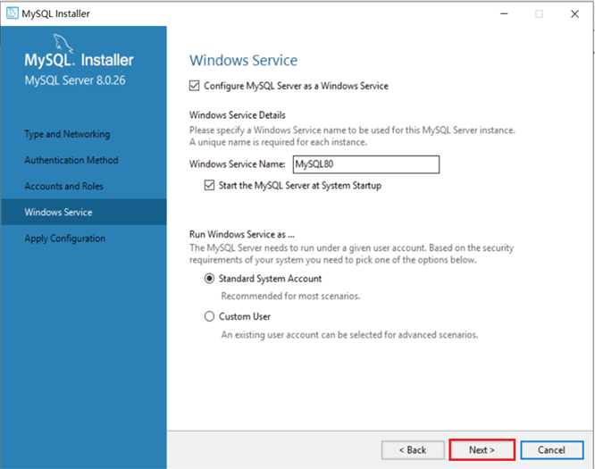

# MySQL Windows系统下安装

## 1、Windows安装包官网下载地址

>  https://dev.mysql.com/downloads/installer/


## 2、双击msi安装包，依次下一步安装


## 3、根据安装提示安装


## 4、**输入MySQL中root用户的密码,一定记得记住该密码**





<br/>

<br/>

# MySQL Linux系统下安装

## 1、Linux安装包官网下载地址

>  https://downloads.mysql.com/archives/community/


## 2、上传至服务器


<br/>

## 3、创建文件夹、解压安装包

```shell
mkdir mysql
tar -xvf mysql-8.0.31-1.el7.x86_64.rpm-bundle.tar -C mysql
```


## 4、安装MySQL RPM包

```shell
yum install openssl-devel
cd mysql
rpm -ivh mysql-community-common-8.0.26-1.el7.x86_64.rpm 
rpm -ivh mysql-community-client-plugins-8.0.26-1.el7.x86_64.rpm 
rpm -ivh mysql-community-libs-8.0.26-1.el7.x86_64.rpm 
rpm -ivh mysql-community-libs-compat-8.0.26-1.el7.x86_64.rpm
rpm -ivh  mysql-community-devel-8.0.26-1.el7.x86_64.rpm
rpm -ivh mysql-community-client-8.0.26-1.el7.x86_64.rpm
rpm -ivh  mysql-community-server-8.0.26-1.el7.x86_64.rpm
```


## 5、启动MySQL服务并设置开机自启

```shell
systemctl enable --now  mariadb.service
```


## 6、查询自动生成的root用户密码

```
grep 'temporary password' /var/log/mysqld.log
```


MySQL登录命令

```
mysql -u root -p
```

然后输入上述查询到的自动生成的密码，完成登录。


## 7、修改root用户密码

登录到MySQL之后，需要将自动生成的不便记忆的密码修改了，修改成自己熟悉的便于记忆的密码。

```
ALTER  USER  'root'@'localhost'  IDENTIFIED BY '1234';
```

执行上述的SQL会报错，原因是因为设置的密码太简单，密码复杂度不够。我们可以设置密码的复杂度为简单类型，密码长度为4。

```
set global validate_password.policy = 0;
set global validate_password.length = 4;
```

降低密码的校验规则之后，再次执行上述修改密码的指令。


## 8、创建用户

默认的root用户只能当前节点localhost访问，是无法远程访问的，我们还需要创建一个root账户，用户远程访问

```
create user 'root'@'%' IDENTIFIED WITH mysql_native_password BY '1234';
```


## 9、并给root用户分配权限

```
grant all on *.* to 'root'@'%';
```


## 10、重新连接MySQL

```
mysql -u root -p
```

然后输入新设置的密码
